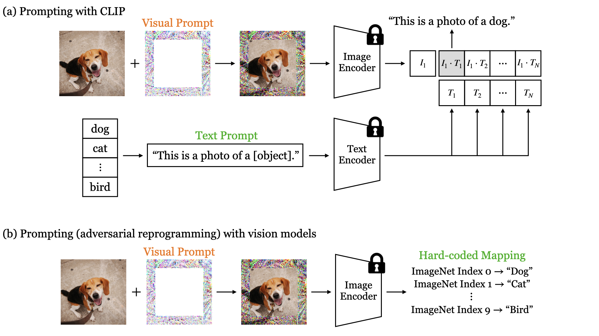

# Visual Prompting
This is the official implementation of the paper [Exploring Visual Prompts for Adapting Large-Scale Models](https://arxiv.org/abs/2203.17274). 




## Installation
Clone this repo:
```bash
git clone https://github.com/hjbahng/visual_prompting.git
cd visual_prompting
```

This code requires python 3+. Install dependencies by:
```bash
pip install -r requirements.txt
```

Prepare the pre-trained models:
```bash
bash models/download_models.sh
```

## Train/Test for CLIP
* Train a visual prompt:
```bash
python main_clip.py --dataset cifar100 --root [path_to_cifar100] 
```

* Test the visual prompt:
```bash
python main_clip.py --evaluate --resume /path/to/checkpoints/model_best.pth.tar --dataset cifar100 --root [path_to_cifar100]
```

## Train/Test for Vision Models
* Train a visual prompt:
```bash
python main_vision.py --model bit_m_rn50 --dataset cifar100 --root [path_to_cifar100]
```

* Test the visual prompt:
```bash
python main_vision.py --evaluate --resume /path/to/checkpoints/model_best.pth.tar --model bit_m_rn50 --dataset cifar100 --root [path_to_cifar100]
``` 
* There are three model choices: `rn50`, `instagram_resnext101_32x8d`, and `bit_m_rn50`.
* Note that we use `--batch_size 32` for `instagram_resnext101_32x8d` and `--batch_size 128` for other models.

## Citation
If you use this code for your research, please cite our paper.
```
@article{bahng2022visual,
         title={Exploring Visual Prompts for Adapting Large-Scale Models}, 
         author={Hyojin Bahng and Ali Jahanian and Swami Sankaranarayanan and Phillip Isola},
         journal={arXiv preprint arXiv:2203.17274},
         year={2022}
}
```
